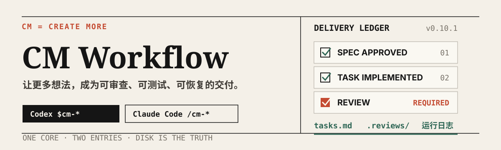
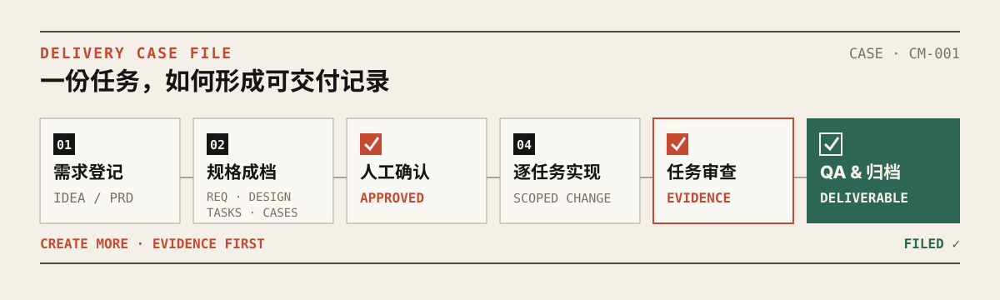
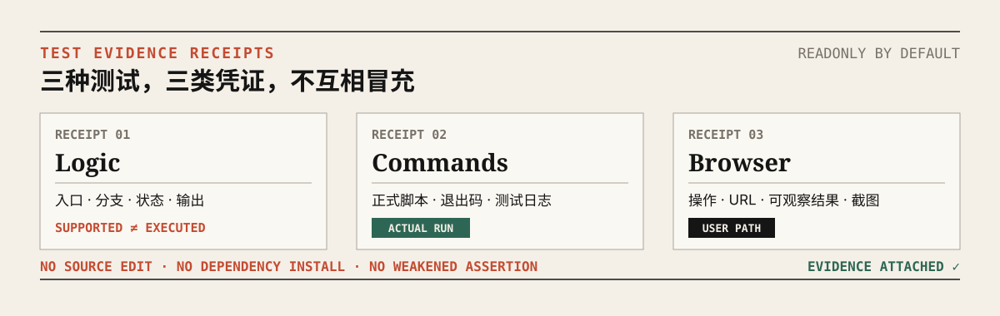
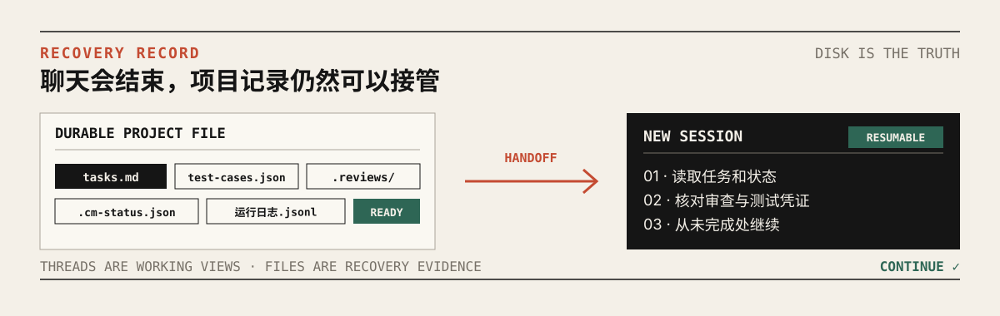

<p align="center">
  
</p>

<p align="center">
  <a href="https://github.com/kingxiaozhe/cm-workflow/actions/workflows/ci.yml"></a>
  <a href="./LICENSE"></a>
  
  
</p>

<p align="center">
  从点子或需求文档出发，生成 specs 与 AI 测试合同，逐任务实现、任务审查、QA，并把每一步交付依据留在磁盘。
</p>

<p align="center">
  <a href="#交付账本">交付账本</a> ·
  <a href="#五分钟开始">五分钟开始</a> ·
  <a href="#工作流入口">工作流入口</a> ·
  <a href="docs/installation.md">完整安装</a> ·
  <a href="docs/architecture.md">架构说明</a>
</p>

## 交付账本

CM Workflow 不把“AI 说完成了”当作完成。一次可交付的开发任务，需要留下可以复查的规格、实现、测试与审查记录。

| 检查项 | 应留下的凭证 | 完成条件 |
| --- | --- | --- |
| 规格 | `requirements.md`、`design.md`、`tasks.md` | 需求和验收标准已经人工确认 |
| 测试意图 | 可选 `test-cases.json` | 用例结构有效，且没有把执行结果写进测试合同 |
| 实现 | 任务范围内的代码、测试与提交 | 正式项目命令实际运行 |
| 任务审查 | `.reviews/` 中的原始审查记录 | 没有未处理的阻断问题；降级必须明确标记 |
| QA | 逻辑核验、命令结果、按需浏览器证据 | 静态判断不冒充测试通过 |
| 恢复 | 状态文件、日志、度量与经验 | 新会话能够从磁盘继续 |

> **No evidence → no completion.** `tasks.md` 是任务状态的唯一权威来源；聊天记录、任务面板和子代理状态都只是可重建的工作视图。

## 五分钟开始

### Codex

需要 Git、Python 3 和当前版本的 Codex。源码目录不能放在
`~/plugins/cm-workflow`，该路径由安装器管理。

```bash
git clone https://github.com/kingxiaozhe/cm-workflow.git
cd cm-workflow
./install-codex.sh
```

安装后新开一个 Codex 对话：

```text
$cm-check
```

### Claude Code

macOS / Linux：

```bash
./install.sh
```

Windows PowerShell：

```powershell
powershell -ExecutionPolicy Bypass -File install.ps1
```

安装后新开 Claude Code 会话并运行 `/cm-check`。覆盖策略、无人值守参数和可选自动更新见
[安装指南](docs/installation.md)。

## 从需求到交付

<p align="center">
  
</p>

```text
点子或需求
  → 形成 PRD
  → 生成 requirements / design / tasks / optional test-cases
  → 人工确认方案
  → 逐任务实现
  → 优先由新上下文独立审查
  → 运行正式测试与 QA
  → 同步文档、度量和恢复凭证
```

执行器默认串行处理任务。只有任务没有依赖、文件边界不重叠、契约稳定，并且当前运行时确实支持时，才允许并行执行。主执行者始终保留 specs、任务状态与提交的单写权。

## 工作流入口

| Skill | 什么时候使用 |
| --- | --- |
| `$cm-idea` | 只有一个模糊点子，需要通过访谈形成 PRD |
| `$cm-init` | 接管已有项目，生成 `AGENTS.md` 与兼容规则 |
| `$cm-prd` | 把需求整理成 requirements、design、tasks 与可选测试合同 |
| `$cm-ai` | 执行已经人工审批的 specs，并支持断点恢复 |
| `$cm-test` | 给存量功能生成测试草稿，或做默认只读的逻辑、命令与浏览器测试 |
| `$cm-fix` | 对可复现缺陷执行红灯测试、根因定位、最小修复与回归 |
| `$cm-refactor` | 在行为等价约束下调整代码结构 |
| `$cm-check` | 检查入口、角色、引用、模板、版本与双运行时一致性 |

一个典型会话：

```text
$cm-init
$cm-prd ~/projects/my-app-specs
$cm-ai ~/projects/my-app-specs ~/code/my-app
$cm-test ~/code/my-app --specs ~/projects/my-app-specs --feature 2.user-login --all
```

从已有代码生成 AI 可读的测试用例草稿：

```text
$cm-test ~/code/my-app 用户登录 --generate-cases
```

生成模式只写草稿与证据报告，结构校验后停止；确认用例意图后，再显式执行测试。

## 审查与测试证据

<p align="center">
  
</p>

### 审查通道

任务完成前按顺序选择审查通道，优先建立独立上下文：

1. fresh Codex 子代理或独立线程；
2. 隔离的只读 Codex CLI 审查；
3. 两者不可用时才允许 `self-degraded`，并在凭证中明确标记。

审查结论必须保存原始证据。没有任务级审查凭证，就不能把任务标记为完成。

### 只读测试

`$cm-test` 把不同类型的证据分开记录：

- **logic**：从入口追踪分支、状态变化与输出；静态支持不能冒充执行测试通过。
- **commands**：只运行项目声明的正式测试、类型检查和构建命令，不现场替换工具链。
- **browser**：按用例模拟用户操作，记录 URL、动作、可观察结果、截图和日志。
- **readonly**：默认不改源码、不安装依赖、不降低断言，也不自动调用 `$cm-fix`。

## 磁盘是最终记录

<p align="center">
  
</p>

| 文件 | 作用 |
| --- | --- |
| `tasks.md` | 唯一权威任务状态 |
| `test-cases.json` | AI 可读的测试意图，不保存执行结果 |
| `.cm-specs-status` | specs 人工审批状态 |
| `.cm-status.json` | 当前执行节点快照 |
| `运行日志.jsonl` | 可回放的事件记录 |
| `.reviews/` | 每轮任务审查与测试凭证 |
| `METRICS.md` / `LESSONS.md` | 度量与持久经验 |

新会话从这些文件重建任务上下文，不依赖上一段聊天是否还在。

## Codex 与 Claude Code

Codex 是主运行时，Claude Code 是兼容运行时。两者直接使用同一组 `skills/` 和
`runtime/`；历史 `/cm:*` 只是 macOS/Linux 上的轻量别名。

| 环境 | 入口 | 安装与差异 |
| --- | --- | --- |
| Codex | `$cm-*` | `install-codex.sh`；OMX 自动探测且缺失不阻断 |
| Claude Code macOS/Linux | `/cm-*`，兼容 `/cm:*` | `install.sh`；Bash 辅助工具原生可用 |
| Claude Code Windows | `/cm-*` | `install.ps1`；Bash 辅助工具需要 WSL 或 Git Bash |

三种入口共用同一份流程实现。运行时不具备独立审查通道时，必须在证据中明确记录降级。

## 人工边界

以下动作始终保留人工确认：

- 生产发布与真实资金操作；
- 密钥、凭证和权限变更；
- 破坏性 migration；
- 超出已审批任务范围的修改。

安装器覆盖既有文件前会列出冲突；Claude 自动更新器只复制，不自动启用。

## 可选可视化

```bash
templates/dashboard/serve.sh {specs路径}
templates/pixel/cm-pixel.sh --demo
templates/pixel/serve.sh {specs路径}
```

这些工具只读 specs 中的状态与度量，不参与执行。

## 维护

修改流程后运行：

```bash
./scripts/cm-check-runtime.sh
python3 scripts/validate-public-repo.py
python3 scripts/scan-public-safety.py
python3 ~/.codex/skills/.system/plugin-creator/scripts/validate_plugin.py .
```

基础版本同时保存在 `VERSION` 与 `.codex-plugin/plugin.json`；安装副本可追加
`+codex.*` cachebuster。贡献前请阅读 [CONTRIBUTING.md](CONTRIBUTING.md)。

## 安全与许可

当前树检查常见密钥形态、个人绝对路径和私有端点；CI 对完整 Git 历史运行
Gitleaks。发现安全问题请按 [SECURITY.md](SECURITY.md) 私下报告。

项目采用 [MIT License](LICENSE)。Darwin Skill 与 Kenney CC0 素材的来源和许可见
[THIRD_PARTY_NOTICES.md](THIRD_PARTY_NOTICES.md)。
