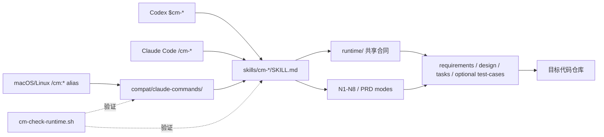

# CM Workflow

[](https://github.com/kingxiaozhe/cm-workflow/actions/workflows/ci.yml)
[](LICENSE)
[](https://github.com/kingxiaozhe/cm-workflow)
[](https://github.com/kingxiaozhe/cm-workflow)

CM Workflow 是一套 Codex-native、spec-driven 的产品开发工作流：

> 点子 / 需求文档 → specs + AI 测试合同 → 实现 → 独立审查 → QA → 文档同步

Codex 是主运行时，Claude Code 是兼容运行时。两者共用 `skills/` 和
`runtime/` 中的同一份流程真相，不再分别维护两套业务规则。

- 一份规格真相：requirements、design、tasks，以及适用时的 `test-cases.json`。
- 一份执行真相：`tasks.md` 与磁盘审计文件。
- 每任务独立审查：无凭证不标记完成。
- 存量功能只读测试：逻辑核验、正式命令和浏览器模拟不自动改代码。
- 可恢复：新会话从磁盘重建，不依赖聊天记忆。
- 风险有边界：生产、资金、密钥、破坏性变更保留人工闸。

[安装指南](docs/installation.md) · [架构说明](docs/architecture.md) ·
[贡献指南](CONTRIBUTING.md) · [安全策略](SECURITY.md)

## Codex 安装

需要当前版本的 Codex，并已完成登录。先把仓库克隆到
`~/plugins/cm-workflow` **之外**的位置，再执行：

```bash
git clone https://github.com/kingxiaozhe/cm-workflow.git
cd cm-workflow
./install-codex.sh
```

脚本会：

1. 用 Codex 自带的 plugin creator 验证源码。
2. 在临时目录组装并再次验证完整插件。
3. 原子更新个人本地 marketplace 插件。
4. 添加 cachebuster 并执行 `codex plugin add`。

安装后**新开一个 Codex 对话**，先运行：

```text
$cm-check
```

然后可以显式调用：

```text
$cm-idea 我想做一个记录宝宝辅食的小程序
$cm-init
$cm-prd ~/projects/my-app-specs
$cm-ai ~/projects/my-app-specs ~/code/my-app
$cm-test ~/code/my-app 用户登录 --generate-cases
$cm-test ~/code/my-app --specs ~/projects/my-app-specs --feature 2.user-login --all
$cm-fix ~/projects/my-app-specs ~/code/my-app 登录后首屏白屏
$cm-refactor ~/projects/my-app-specs ~/code/my-app 拆分过大的订单服务
```

> 插件更新后也需要新开对话，已打开的对话不会热重载 Skills。

## Claude Code 兼容安装

macOS / Linux：

```bash
./install.sh
```

Windows：

```powershell
powershell -ExecutionPolicy Bypass -File install.ps1
```

跨平台入口与 Skill 同名：`/cm-idea`、`/cm-init`、`/cm-prd`、`/cm-ai`、
`/cm-test`、`/cm-fix`、`/cm-refactor`、`/cm-check`。macOS/Linux 安装器另外生成历史
`/cm:*` 别名；Windows 文件系统不支持冒号文件名，因此只提供 `/cm-*`。

## 兼容性矩阵

| 能力 | Codex | Claude Code macOS/Linux | Claude Code Windows |
| ---- | ---- | ---- | ---- |
| 主入口 | `$cm-*` | `/cm-*`；兼容 `/cm:*` | `/cm-*` |
| 权威流程 | `skills/` + `runtime/` | 同一份 | 同一份 |
| 安装器 | `install-codex.sh` | `install.sh` | `install.ps1` |
| 核心 Markdown 流程 | 支持 | 支持 | 支持 |
| 独立审查 | 子代理/隔离 CLI/显式降级 | 可用运行时能力/显式降级 | 可用运行时能力/显式降级 |
| Bash 状态条/看板 | macOS/Linux | 原生 | WSL 或 Git Bash |
| 可选 OMX 镜像 | 自动探测，缺失不阻断 | 不作为依赖 | 不作为依赖 |

覆盖策略、无人值守参数和可选自动更新见[完整安装指南](docs/installation.md)。

## 核心流程

| Skill | 用途 |
| --- | --- |
| `$cm-idea` | 把模糊想法访谈成 PRD |
| `$cm-init` | 分析存量项目，生成 `AGENTS.md` 和 `.claude/` 兼容规则 |
| `$cm-prd` | 生成 requirements/design/tasks 与可选 `test-cases.json`，支持 greenfield、brownfield 和 change |
| `$cm-ai` | 按 N1–N8 执行已审批 specs，支持断点恢复 |
| `$cm-test` | 从已实现代码生成测试用例草稿，或做默认只读的逻辑、正式命令和浏览器测试 |
| `$cm-fix` | 复现 → 根因 → 红灯测试 → 最小修复 → 回归 |
| `$cm-refactor` | 用行为判官保证重构前后等价 |
| `$cm-check` | 检查插件、双运行时入口、引用、模板与版本 |

`$cm-ai` 的执行状态机：

```text
N1 初始化
 → N2 进入 Feature / 恢复断点
 → N3 执行 Task
 → N4 主执行者自审 + 新上下文独立审查
 → N5 标记 tasks.md / 度量 / 提交
 → N6 QA 评估
 → N7 从磁盘重载上下文
 → N8 文档与度量收口
```

## 架构



Codex 和 Claude Code 都直接发现同一组 Skills；只有 macOS/Linux 历史
`/cm:*` 别名经过三行兼容包装。路径从当前 Skill 相对解析，不依赖某个用户的
cache 或主目录。更多细节见
[架构说明](docs/architecture.md)。

## 持久化真相

Codex 计划、OMX 状态、子代理线程和 Claude 任务面板都是可重建镜像。下列文件才是断点恢复与审计依据：

- `tasks.md`：唯一权威任务源。
- `test-cases.json`：适用 feature 的 AI 可读测试意图，不保存执行结果。
- `.cm-specs-status`：规格是否已经人工审批。
- `.cm-status.json`：当前节点快照。
- `运行日志.jsonl`：可回放的事件记录。
- `.reviews/`：每轮独立审查的原始凭证。
- `METRICS.md` 和 `LESSONS.md`：度量与持久经验。

## 审查与并行

审查不依赖旧的 `codex:review` 伪调用。通道顺序为：

1. fresh Codex 子代理/独立线程。
2. 隔离的只读 Codex CLI 审查会话。
3. 两者都不可用时才使用 `self-degraded`，并在凭证中如实标记。

串行是默认。只有任务无依赖、文件边界不重叠、契约稳定且当前 Codex 确实支持时才派发子代理。子代理不写 specs、不标记完成、不提交；主执行者保留单写权。

## 目录

```text
.codex-plugin/plugin.json       # Codex plugin manifest
skills/
├── cm-{idea,init,prd,ai,test,fix,refactor,check}/
├── cm-*-engineer/           # 工种能力
├── cm-{product-manager,finance-expert,doc-syncer}/
└── idea-to-prd/              # 独立访谈 Skill
runtime/                        # 项目上下文、调度、审查与 AI 测试合同
compat/claude-commands/         # macOS/Linux 历史 /cm:* 别名源
agents/                         # Claude Code 兼容 agent 定义
templates/                      # rules/hooks/refactor/UI/可视化资产
scripts/cm-check-runtime.sh     # 机械一致性检查
scripts/validate-test-cases.py  # AI 测试合同结构校验
scripts/validate-public-repo.py # 公开包结构验证
scripts/scan-public-safety.py   # 当前树敏感信息检查
docs/                           # 安装、架构、示例与设计材料
install-codex.sh                # Codex 个人 marketplace 安装
install.sh / install.ps1        # Claude Code 兼容安装
```

## 可视化（可选）

```bash
templates/dashboard/serve.sh {specs路径}
templates/pixel/cm-pixel.sh --demo
templates/pixel/serve.sh {specs路径}
```

它们只读 specs 中的状态与度量文件，不参与执行。

## 维护与验证

修改流程后执行：

```bash
./scripts/cm-check-runtime.sh
python3 scripts/validate-public-repo.py
python3 scripts/scan-public-safety.py
python3 ~/.codex/skills/.system/plugin-creator/scripts/validate_plugin.py .
```

基础版本同时写在 `VERSION` 和 `.codex-plugin/plugin.json`；安装副本可追加
`+codex.*` cachebuster。

Windows 下 Markdown 核心流程可直接用于 Claude Code；Bash 状态条与可视化脚本建议在 WSL 或 Git Bash 中运行。

## 安全与许可

- 当前树检查常见密钥形态、个人绝对路径和私有端点。
- CI 对完整 Git 历史运行 Gitleaks。
- 安装器覆盖既有文件前列出冲突；无人值守参数必须显式传入。
- Claude 自动更新器只会被复制，不会被自动启用。
- 项目采用 [MIT License](LICENSE)。
- Darwin Skill 和 Kenney CC0 素材的来源与许可见
  [THIRD_PARTY_NOTICES.md](THIRD_PARTY_NOTICES.md)。

发现敏感问题请按 [SECURITY.md](SECURITY.md) 私下报告，不要在公开 Issue 粘贴凭证。
