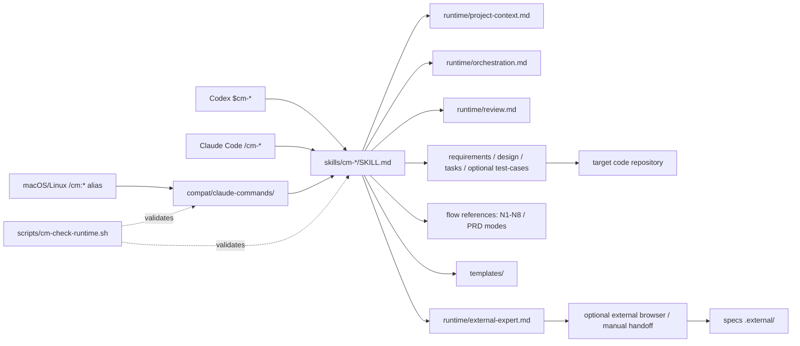

# Architecture

CM Workflow has one workflow implementation and two runtime entry surfaces.

## Sources of truth

- `tasks.md` is the authoritative business-task state.
- `.cm-specs-status`, `.cm-status.json`, `运行日志.jsonl`, `.reviews/`,
  `METRICS.md`, and `LESSONS.md` are the durable audit and recovery artifacts.
- Codex plans, OMX state, subagent threads, and Claude task panels are
  reconstructable mirrors.
- Per-feature `test-cases.json` is the optional AI-readable test intent.
  Execution results stay in `.reviews/`; no competing result database is added.

## Runtime compatibility

Codex discovers the plugin through `.codex-plugin/plugin.json` and calls Skills
directly. Claude Code invokes the same Skills as `/cm-*` on every platform.
The macOS/Linux installer also maps the three-line compatibility wrappers to
the historic `/cm:*` aliases. Windows uses `/cm-*` because `:` is not legal in
native filenames. Workflow assets resolve relative to the active Skill; no flow
may hardcode a Codex cache path or treat `~/.claude` as the universal source
root.

## Review model

Implementation cannot be marked complete without task-scoped review evidence.
The preferred channel is a fresh Codex subagent or independent thread, followed
by an isolated read-only Codex CLI review. `self-degraded` is allowed only when
independent channels are unavailable and must be recorded in the evidence.

## External reasoning model

`external-expert` is an independent utility Skill for product deliberation,
problem or academic research, diagnosis, test design, and critique. CM defaults
to EXPLICIT activation. A user can opt only the current invocation into AUTO,
which routes to LOCAL, CONSULT, or VERIFY; HANDOFF is explicit-only. A global
router cannot silently enable CM AUTO. The local main agent chooses outbound
context, applies accepted changes, and runs verification.

Requests and raw responses live under `.external/`; they cannot satisfy N4.
If an external conversation contributed to a plan, diagnosis, tests, or patch,
it is an authoring channel and is ineligible to review the same work.

Before browser dispatch, the runtime routes visible modes through
`Pro → Extra High → High → SKIPPED`. Fallback inside this chain is automatic;
Medium and Instant are excluded. `SKIPPED` sends nothing and returns control to
the local workflow. An explicit strict-Pro request blocks when Pro is missing.
Task routing is a separate earlier gate; AUTO never authorizes local-file
transmission and mixed-task implementation remains local.

## Testing model

`cm-prd` can generate one `test-cases.json` per behavior-bearing feature.
`cm-ai` consumes logic cases during task review and browser cases during QA.
`cm-test` is a separate, default-read-only entry for already implemented
features. Its `--generate-cases` mode reads existing code and writes a validated
inferred draft, then stops before execution. Test failures can be handed to
`cm-fix` only by an explicit user decision.
