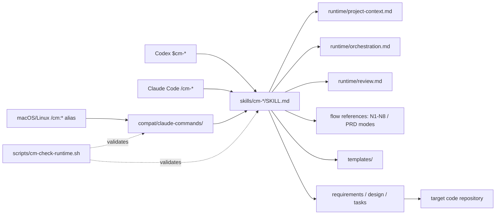

# Architecture

CM Workflow has one workflow implementation and two runtime entry surfaces.

## Sources of truth

- `tasks.md` is the authoritative business-task state.
- `.cm-specs-status`, `.cm-status.json`, `运行日志.jsonl`, `.reviews/`,
  `METRICS.md`, and `LESSONS.md` are the durable audit and recovery artifacts.
- Codex plans, OMX state, subagent threads, and Claude task panels are
  reconstructable mirrors.

## Runtime compatibility

Codex discovers the plugin through `.codex-plugin/plugin.json` and calls Skills
directly. Claude Code invokes the same Skills as `/cm-*` on every platform.
The macOS/Linux installer also maps the three-line compatibility wrappers to
the historic `/cm:*` aliases. Windows uses `/cm-*` because `:` is not legal in
native filenames. Workflow assets resolve relative to the active Skill; no flow
may hardcode a Codex cache path or treat `~/.claude` as the universal source
root.

## Review model

Implementation cannot be marked complete without task-scoped review evidence.
The preferred channel is a fresh Codex subagent or independent thread, followed
by an isolated read-only Codex CLI review. `self-degraded` is allowed only when
independent channels are unavailable and must be recorded in the evidence.
