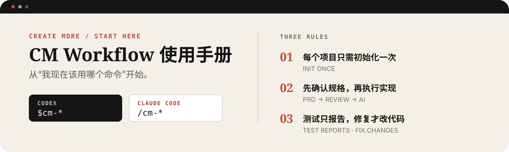
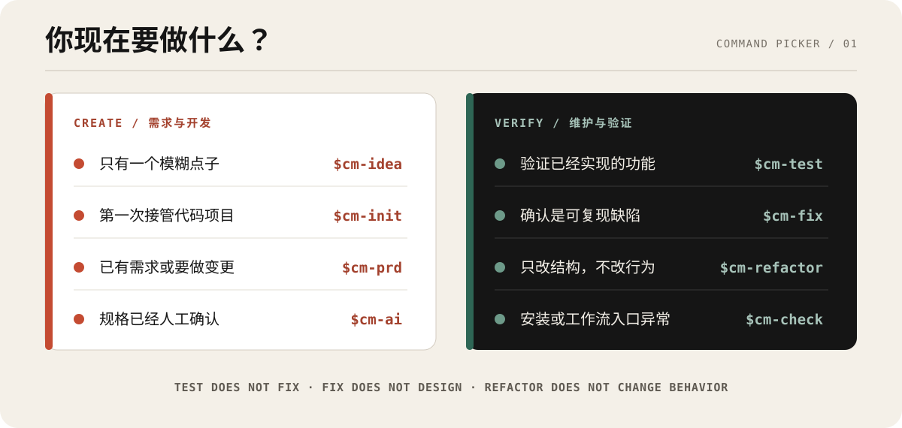

# CM Workflow 使用手册

<p align="center">
  <picture>
    <source media="(max-width: 600px)" srcset="../assets/docs/user-guide-hero-mobile.svg">
    
  </picture>
</p>

<p align="center">
  <a href="#我现在该用哪个命令">命令选择</a> ·
  <a href="#第一次完整开发">首次开发</a> ·
  <a href="#六条常见任务路线">常见路线</a> ·
  <a href="#cm-test-到底会测试什么">测试说明</a> ·
  <a href="#我现在走到哪一步了">状态恢复</a> ·
  <a href="#常见卡点">常见卡点</a>
</p>

这不是一份需要从头背完的命令字典。每次回来时，先判断自己**现在想做什么**，再从对应入口开始。

> **记住三条就够了：** 一个代码项目通常只需运行一次 `$cm-init`；新需求先 `$cm-prd`、人工确认后再 `$cm-ai`；`$cm-test` 默认只报告问题，真正修复使用 `$cm-fix`。

## 先确认你的运行环境

本文示例默认使用 Codex。Claude Code 使用同一套工作流，只需替换命令前缀：

| 环境 | 命令写法 | 示例 |
| --- | --- | --- |
| Codex | `$cm-*` | `$cm-check`、`$cm-ai` |
| Claude Code | `/cm-*` | `/cm-check`、`/cm-ai` |

安装后必须新开会话，再运行 `$cm-check`。如果检查通过，就不需要每次任务都重复执行它。

## 我现在该用哪个命令？

<p align="center">
  <picture>
    <source media="(max-width: 600px)" srcset="../assets/docs/command-picker-mobile.svg">
    
  </picture>
</p>

| 你现在的情况 | 使用入口 | 会改业务源码吗？ | 完成后的下一步 |
| --- | --- | --- | --- |
| 只有一个模糊点子 | `$cm-idea` | 否，只产出 PRD | 把 PRD 放入 specs 的 `docs/`，运行 `$cm-prd` |
| 第一次接管已有项目 | `$cm-init` | 否，但会生成项目规则和上下文 | 准备需求文档或直接测试已有功能 |
| 已有需求文档 | `$cm-prd {specs路径}` | 否，只整理规格 | 人工审查摘要、方案和任务 |
| 修改已经存在的功能 | `$cm-prd --change …` | 否，只增加变更规格 | 人工审查后运行 `$cm-ai` |
| 规格已经确认 | `$cm-ai {specs路径} {代码路径}` | **是** | 查看审查、测试和交付凭证 |
| 想测试已有功能 | `$cm-test …` | 否，默认只写报告与证据 | 对失败项决定修环境、补规格或 `$cm-fix` |
| 已确认是缺陷 | `$cm-fix …` | **是** | 查看红灯测试、修复和回归结果 |
| 只想改善代码结构 | `$cm-refactor …` | **是**，但不得改变行为 | 查看等价性验证和审查结果 |
| 想讨论方案、研究问题或查论文 | `$external-expert …` | 否 | 查看外部原始回答、本地裁决与待验证项 |
| 安装或入口不正常 | `$cm-check` | 否，只检查 | 按检查结果修复安装或配置 |

### 不想记命令，也可以直接描述目标

Codex 与 Claude Code 会先根据 Skill 的 `description` 判断入口。自然语言分流不是
硬编码路由：目标明确时可以直接说，目标有歧义时应先确认；需要确定入口时仍可显式
点名 `$cm-*` 或 `/cm-*`。自然表达**只负责选择流程**，不能替代规格批准、生产确认
或其他人工闸门。

| 入口 | 明确点名 | 自然表达 | 模糊或越界时 |
| --- | --- | --- | --- |
| `cm-idea` | `$cm-idea 帮我梳理这个点子` | “我有个产品想法，先帮我聊清楚” | 已有完整需求文档 → `cm-prd` |
| `cm-init` | `$cm-init` | “第一次接管这个仓库，先生成项目规则” | 空项目或普通改代码 → 不触发 |
| `cm-prd` | `$cm-prd {specs路径}` | “把这份需求拆成方案、任务和验收标准” | 要求直接编码 → 先确认 specs 是否已审批 |
| `cm-ai` | `$cm-ai {specs路径} {代码路径}` | “规格已经审查通过，按 specs 开始实现” | 仅说“继续”或规格未审 → 不批准编码 |
| `cm-test` | `$cm-test …` | “验证一下现有登录功能，再用浏览器走查” | 用户只说“好像有问题” → 先测试，不自动修 |
| `cm-fix` | `$cm-fix …` | “这个 bug 已经能复现，请按失败报告修复” | 尚未复现 → `cm-test`；新增需求 → `cm-prd` |
| `cm-refactor` | `$cm-refactor …` | “只整理这段代码结构，不改变行为” | 要改变功能或修 bug → 转交对应流程 |
| `cm-check` | `$cm-check` | “检查一下 CM 是否安装正确，为什么没有命令” | 测试业务功能 → `cm-test` |

## 两个目录不要混淆

CM Workflow 经常同时使用两个目录：

```text
~/code/my-app/                 ← 代码项目：真正的源码、测试和 Git 仓库
~/projects/my-app-specs/       ← specs 项目：需求、方案、任务和运行凭证
├── docs/                      ← 先把 PRD、需求说明、原型说明放这里
├── 1.user-login/
│   ├── requirements.md
│   ├── design.md
│   ├── tasks.md
│   └── test-cases.json        ← 可选，保存测试意图
├── .cm-specs-status
├── .cm-status.json
├── .cm-run.json               ← 当前/最近一次运行标识
├── .cm-run.lock               ← 并发写入锁（自动维护）
├── .reviews/                  ← task handoff、独立 Review、PRD 处置回执与测试证据
└── 运行日志.jsonl
```

- **代码项目**回答“要修改什么”。
- **specs 项目**回答“为什么改、准备怎么改、做到哪一步、证据在哪里”。
- 两者可以在不同路径，也可以由你按项目习惯组织；命令里把路径说清楚即可。

### 可选的项目角色与模型配置

如果不同项目需要不同角色或模型，可以把
`{CM_WORKFLOW_ROOT}/templates/cm-workflow.yml` 复制到代码项目根目录，命名为
`.cm-workflow.yml` 后修改。它只配置角色、适配器、模型别名和测试/交付策略，不保存任何
凭据；配置缺失时仍使用当前默认流程。检查有效配置：

```bash
python3 {CM_WORKFLOW_ROOT}/scripts/cm_workflow_config.py --project {代码项目路径}
python3 {CM_WORKFLOW_ROOT}/scripts/cm_workflow_config.py --project {代码项目路径} --print-effective
```

常见的请求分工是：编码角色选择 Codex CLI/订阅，需求和方案角色选择 Claude/Fable 等
兼容 API，测试和浏览器 QA 使用本地工具，外部专家继续通过显式浏览器调用和既有降级
链运行。`route_state: declared-adapter` 只代表项目请求了该适配器，当前运行时没有
观察到它实际执行；不要把配置别名当成后端模型或测试结果。
角色到节点的映射、`route_state` 和日志字段见
`{CM_WORKFLOW_ROOT}/runtime/workflow-routing.md`。

策略会实际投影到流程：`generate_cases` 控制自动补测试用例，`tests` 控制可选 QA
类型，`auto_fix` 控制 QA 失败后的修复方式，`delivery` 选择 diff、本地 branch 或
Draft MR。`draft-mr` 仍会在 push/MR 前询问一次明确授权，配置本身不是远端权限。

## 第一次完整开发

<p align="center">
  
</p>

### 1. 接管代码项目

进入真正的代码仓库，在新会话中运行：

```text
$cm-init
```

它会分析项目并生成适用于 Agent 的项目规则与代码库上下文。已有项目通常只需执行一次；项目结构或关键命令大幅变化时再更新。

### 2. 准备需求资料

创建一个 specs 目录，把 PRD、需求说明或原型说明放进 `docs/`：

```text
~/projects/my-app-specs/
└── docs/
    └── user-login.md
```

如果你只有一句点子，先运行 `$cm-idea` 形成 PRD，再把结果保存到这里。

### 3. 生成可审查规格

```text
$cm-prd ~/projects/my-app-specs
```

它会产出 `requirements.md`、`design.md`、`tasks.md`，并在需要时生成 `test-cases.json`。这一步**不会开始写业务代码**。

### 4. 人工确认

检查工作流给出的需求摘要、方案、任务边界和验收条件。确认没有问题后，再进入实现。

`$cm-ai` 遇到 `.cm-specs-status` 为 `awaiting_review` 时会暂停。你必须明确回复“开始”；普通的“继续”不算审批。

### 5. 执行实现

每个任务实现后，CM 会先生成结构化 handoff，记录本轮修改文件、真实验证、证据、
阻塞和范围偏差；它只是执行证据，不会自行勾选 `tasks.md`。随后独立 Review 写入
`approved / changes_requested / blocked`。只有当前轮为 `approved` 时，N5 才能标记
完成；第 1 轮要求修改会回到实现，第 2 轮仍阻塞则停止等待人工处理。

默认仍是串行。只读探索可以并行；两个任务要同时修改代码时，必须位于同一仓库的
不同 Git Worktree 和不同分支，否则工作流自动降级串行。

```text
$cm-ai ~/projects/my-app-specs ~/code/my-app
```

多个代码项目时直接说明各自路径：

```text
$cm-ai ~/projects/my-app-specs 前端在~/code/web，后端在~/code/api
```

工作流会按 N1–N8 串行执行任务、测试、独立审查和归档。非人工确认节点会自动继续，不需要你反复输入“继续”。

### 6. 查看交付凭证

完成后重点查看：

- `tasks.md`：任务是否真正完成；
- `.reviews/`：每轮独立审查和测试证据；
- `.cm-run.json`：当前会话是否复用同一次运行；
- `运行日志.jsonl`：过程是否可回放；
- `METRICS.md`、`LESSONS.md`：本次度量和沉淀；
- 代码仓库中的 diff、测试与提交。

### 7. 跨项目统一查看日志

CM 会在首次记录事件时自动创建本机用户级日志目录：

```text
~/.cm-workflow/logs/
├── index.jsonl                  ← 每次运行的开始/完成索引
└── runs/
    └── YYYY-MM/
        └── {run_id}.jsonl       ← 这一轮的完整标准化事件
```

它汇总 `cm-prd`、`cm-ai`、`cm-test`、`cm-fix`、`cm-refactor` 和
`external-expert` 的运行开始、规格状态、测试执行、修复/重构、外部专家路由以及
提交交付等事件。常用查看方式：

```bash
tail -n 20 ~/.cm-workflow/logs/index.jsonl
find ~/.cm-workflow/logs/runs -name '*.jsonl' -type f
python3 /path/to/cm-workflow/scripts/cm-prd-timing.py --last 5
python3 /path/to/cm-workflow/scripts/cm-usage-report.py --last 10
```

`cm-prd-timing.py` 给出最近几次 `$cm-prd` 的阶段活跃耗时、最慢阶段、人工暂停次数和实际
触发的方案/规格审查次数。它是只读报告，不会修改项目状态；未配对事件只会标记，
不会猜测耗时。将 `/path/to/cm-workflow` 替换为当前 CM Workflow 安装目录。

`cm-usage-report.py` 只汇总适配器真实返回并写入日志的 API 用量：按流程、阶段、角色和模型
分开显示 input/output/cache counts；拿不到 usage 的调用保持 `unavailable`，不会猜
Token 或费用；同时区分 success/error/blocked/cancelled。已经 claim 但没有有效完成事件的
调用会单列为 `unresolved`，不计入调用、结果或 Token。需要机器读取时追加 `--json`。

项目角色使用 `adapter: openai-compatible` 时，CM 可在真实 HTTP 响应边界自动记录上述
数据。启动 Codex/Claude 前显式配置本次调用环境（密钥不要写进项目文件）：

```bash
export CM_OPENAI_COMPATIBLE_ENABLED=true
export CM_OPENAI_COMPATIBLE_BASE_URL="https://你的中转站/v1"
export CM_OPENAI_COMPATIBLE_API_KEY="你的密钥"
```

然后在 `.cm-workflow.yml` 为需要的分析、规划或编码辅助角色配置
`adapter: openai-compatible`、模型别名和 `source: api`。CM 会按
`runtime/model-efficiency.md` 生成最小角色包并调用内置边界；Prompt 和回答会发给该配置
API，但不会进入 CM 日志。远程地址必须使用 HTTPS。版本 1 不支持把该适配器配置给
`reviewer`，因为文本 API 回答不能替代 N4 的独立审查凭证，配置校验会在调用前拒绝。

如果希望写到其他本机目录，可在运行 Codex 或 Claude Code 前设置：

```bash
export CM_WORKFLOW_LOG_HOME="$HOME/my-cm-logs"
```

这不是云端遥测。项目 specs 中的 `运行日志.jsonl` 仍是权威记录，全局日志只是便于
汇总分析的私有镜像；它不会记录 Prompt、模型原始回答、外部会话链接、源码正文或凭证。
全局镜像写入失败时，带 specs 的工作流会在项目日志记录 `degrade` 后继续；没有项目
日志可兜底的独立运行则会明确失败。

## 六条常见任务路线

<details>
<summary><strong>路线 A：我只有一个产品点子</strong></summary>

```text
$cm-idea 我想做一个支持团队审批的发布工具
```

按访谈形成 PRD后：

1. 把 PRD 保存到 `{specs路径}/docs/`；
2. 运行 `$cm-prd {specs路径}`；
3. 人工检查 specs；
4. 运行 `$cm-ai {specs路径} {代码路径}` 并明确回复“开始”。

</details>

<details>
<summary><strong>路线 B：已有项目要开发新功能</strong></summary>

```text
$cm-init
$cm-prd ~/projects/my-app-specs
$cm-ai ~/projects/my-app-specs ~/code/my-app
```

`$cm-init` 只在首次接管或项目事实明显变化时执行。后续功能通常从准备需求文档和 `$cm-prd` 开始。

</details>

<details>
<summary><strong>路线 C：要修改已经存在的功能</strong></summary>

```text
$cm-prd --change 2.user-login 登录失败五次后锁定账号 30 分钟
```

这是**行为变更**，需要更新需求、设计和任务，不能直接塞进 `$cm-fix` 或 `$cm-refactor`。审查变更规格后，再运行 `$cm-ai`。

</details>

<details>
<summary><strong>路线 D：已有功能没有测试用例</strong></summary>

先让 AI 从代码逻辑生成测试意图草稿：

```text
$cm-test ~/code/my-app 用户登录 --generate-cases
```

草稿中的 `[需确认]` 表示 AI 无法仅凭代码确认的业务意图。人工确认后，在生成的
`test-cases.generated.json` 中删除已确认项的 `[需确认]` 前缀，并把对应
`origin` 改为 `user`，再执行：

```text
$cm-test ~/code/my-app --cases /生成报告路径/test-cases.generated.json --all
```

如果用例已经保存为 feature 的 `test-cases.json`，也可以使用
`--specs {specs路径} --feature {N.feature}`。不想生成草稿时，则直接描述功能做
一次只读测试：

```text
$cm-test ~/code/my-app 用户登录
```

</details>

<details>
<summary><strong>路线 E：已经确认是一个缺陷</strong></summary>

```text
$cm-fix ~/projects/my-app-specs ~/code/my-app 登录成功后仍然停留在登录页
```

`$cm-fix` 会先建立可复现的红灯测试，再定位根因、做最小修复、回归并审查。若调查发现实际需要新增行为或改变契约，应退出修复流，改走 `$cm-prd --change`。

</details>

<details>
<summary><strong>路线 F：代码能工作，但结构需要整理</strong></summary>

```text
$cm-refactor ~/projects/my-app-specs ~/code/my-app 拆分过大的订单服务，不改变外部行为
```

重构必须先锁定行为基线。若目标包含新能力、接口变化或数据库语义变化，它就不是重构，应改走变更规格。

</details>

## 九个入口速查

| 入口 | 主要输入 | 主要产出 | 关键边界 |
| --- | --- | --- | --- |
| `$cm-check` | 当前安装 | 机械与语义检查报告 | 只报告，不自动修复 |
| `$cm-idea` | 一句话点子 | 可交付 PRD | 不自动进入 `$cm-prd` |
| `$cm-init` | 当前代码项目 | `AGENTS.md`、兼容规则、代码库上下文 | 不实现业务功能 |
| `$cm-prd` | specs 的 `docs/` | requirements、design、tasks、可选测试合同 | 在人工审查处停止 |
| `$cm-ai` | 已审查 specs + 代码项目 | 实现、测试、审查和恢复凭证 | 超出 specs 的修改不应自行扩张 |
| `$cm-test` | 代码、功能说明或测试用例 | 草稿、报告、截图和日志 | 默认只读，不装依赖、不修代码 |
| `$cm-fix` | 可复现缺陷 | 红灯测试、最小修复、回归和审查 | 不承载新需求设计 |
| `$cm-refactor` | 重构目标与行为基线 | 等价重构、验证和审查 | 不允许改变外部行为 |
| `$external-expert` | 产品问题、研究问题或待批判材料 | 外部原始回答、本地裁决、待验证项 | 默认显式触发、可为本次任务 AUTO、文本优先、不改代码、不满足 N4 |

## 什么情况交给外部专家？

```text
$external-expert 帮我比较事件驱动和定时轮询两个方案，重点分析恢复和成本
$external-expert 根据这段脱敏日志提出根因假设，并为每个假设设计证伪步骤
$external-expert 研究 durable agent workflow 的论文，只使用论文或官方资料支撑结论
$external-expert --auto 判断这个问题应留在本地、咨询专家还是做权威核验
```

外部专家适合产品讨论、方案取舍、问题研究、学术研究、根因假设、测试设计和对抗
审查。默认是 `EXPLICIT`；`--auto`、“本次任务自动分流”或“模式：AUTO”只为当前
任务开启智能路由，结束即失效。单独安装的全局分流器不会自动替你开启 CM AUTO。

| 路由 | 什么时候使用 |
| --- | --- |
| `LOCAL` | 编码、命令、测试执行、页面 QA、Git、普通仓库操作与 N4 |
| `CONSULT` | 多方案、竞争解释、冲突约束、深度批判或大量材料综合 |
| `VERIFY` | 时效性、高风险、发布级事实或必须依赖官方/一手来源 |
| `HANDOFF` | 只有你明确要求只转交并返回链接时 |

AUTO 永不选择 HANDOFF。混合任务只外发可分离的讨论或研究部分，代码与最终验收仍
由本地完成。它不读取本地仓库的隐含内容；确需发送本地文件时，工作流会逐个展示普通文件
解析符号链接后的规范绝对路径，并要求用户在当前调用中紧随这份清单重新确认。目录、
glob、未解析符号链接、所有归档、编码归档、归档衍生批量上下文、`.env`、Token、
Cookie、私钥、浏览器状态和客户数据始终禁止外发；AUTO 本身不是文件授权。

Codex Desktop 在浏览器能力可用、用户已登录且有可写的持久证据位置时可以新建外部
对话；否则会输出完整 handoff packet 供手工复制。每个独立问题使用新对话，回答
较慢时不会重复发送。

发送前会检查模型选择器，并按 `Pro → Extra High → High` 选择第一个可用模式，不再
为降级单独询问。三者都不可用时不会发送任何内容，外部专家记为 `SKIPPED`，当前
任务继续由本地 Codex/Claude 完成；Medium 和 Instant 不参与降级。只有你明确说
“必须 Pro”或“不允许降级”时，Pro 不可用才会暂停。

也可以显式写“模式：LOCAL / CONSULT / VERIFY / HANDOFF”。显式模式优先于 AUTO；
HANDOFF 只提交一次并返回对话链接，不读取回答，也不声称完成或正确。

外部回答回来后，本地主执行者会把关键建议标记为 `accepted`、`rejected` 或
`needs-verification`。学术研究的关键来源仍需本地打开核验；外部声称运行了测试
不能作为执行证据。请求、原始回答和裁决在有 specs 时保存到 `.external/`，不会
冒充 `.reviews/` 中的 N4 凭证。

## `$cm-test` 到底会测试什么？

```text
$cm-test {代码项目} {功能描述} --generate-cases
$cm-test {代码项目} --specs {specs路径} --feature {N.feature} --all
$cm-test {代码项目} --cases {用例文件路径} --browser
$cm-test {代码项目} --explore {页面或用户流程}
```

| 模式 | 做什么 | 不代表什么 |
| --- | --- | --- |
| `logic` | 沿代码入口追踪分支、状态变化和输出 | 静态支持不能冒充运行通过 |
| `commands` | 运行项目正式声明的测试、类型检查和构建命令 | 替代命令不能冒充正式命令 |
| `browser` | 模拟用户操作并保存可观察结果、截图和日志 | 页面能打开不等于业务流程通过 |
| `all` | 组合 logic、commands、browser；默认模式 | 某一层 PASS 不能覆盖另一层 FAIL |

测试环境缺依赖时，`$cm-test` 会记录 `BLOCKED`，不会擅自安装依赖或降低断言。先人工修复环境，再重跑原命令。

## 我现在走到哪一步了？

磁盘状态比聊天记录可靠。忘记进度时，检查这些文件：

| 看到的状态 | 表示什么 | 下一步 |
| --- | --- | --- |
| `.cm-specs-status = awaiting_review` | 规格已生成，等待人工确认 | 查看摘要和 specs，运行 `$cm-ai` 后明确回复“开始” |
| `.cm-specs-status = approved` | 规格已批准 | 运行或重新运行同一个 `$cm-ai` 命令 |
| `.cm-status.json` 显示 `running` | 执行曾经开始 | 在新会话重跑同一命令，从磁盘恢复 |
| `.cm-status.json` 显示 `paused_for_human` | 正在等待人工决策 | 读取暂停原因，再明确批准或调整 |
| `tasks.md` 仍有 `[ ]` | 还有未完成任务 | 重跑 `$cm-ai`，不要手工伪造完成状态 |
| `.cm-status.json` 显示 `done` | 流程节点已完成 | 仍需检查 review、测试与 Git 结果 |
| 测试报告为 `FAIL` | 已得到失败证据 | 若是缺陷，进入 `$cm-fix` |
| 测试报告为 `BLOCKED` | 环境不具备执行条件 | 修复环境后重跑，不能写成 PASS |

<p align="center">
  
</p>

### 新会话怎么继续？

不用让新会话读取旧聊天。进入相同项目，重新运行原命令即可：

```text
$cm-ai ~/projects/my-app-specs ~/code/my-app
```

工作流会从 `tasks.md`、`.cm-status.json`、`.cm-run.json`、`.reviews/` 和
`运行日志.jsonl` 重建上下文，并从未完成位置继续。
任务和 AC 的正常 `[x]` 进度不会触发重新审批；如果任务/AC 文案、方案或测试合同
发生变化，入口仍会恢复为 `awaiting_review`，要求重新审查规格。

## 常见卡点

### 找不到 `$cm-*` 或 `/cm-*`

安装后需要新开会话。先运行 `$cm-check`；仍不可用时重新检查安装路径和安装输出。

### `$cm-prd` 提示没有输入文档

确认 `{specs路径}/docs/` 存在且至少包含一份非空需求文档。不要把代码目录误传成 specs 目录。

### `$cm-ai` 一直停在审查状态

这是人工闸门，不是故障。阅读摘要与 specs，确认无误后明确回复“开始”。“继续”“好的”不会被当作规格批准。

### `$cm-test` 没有自动修复问题

这是设计边界。`$cm-test` 默认只读；确认是缺陷后，显式运行 `$cm-fix`。

### 不确定是修复、重构还是变更

用这条判断：

- **原本承诺的行为没有做到** → `$cm-fix`；
- **外部行为不变，只整理结构** → `$cm-refactor`；
- **用户可见行为、接口或业务规则要变化** → `$cm-prd --change`。

## 可复制的最小清单

```text
# 1. 安装健康检查（安装后或异常时）
$cm-check

# 2. 首次接管代码项目（在代码仓库中）
$cm-init

# 3. 从需求文档生成规格
$cm-prd ~/projects/my-app-specs

# 4. 人工审查后执行
$cm-ai ~/projects/my-app-specs ~/code/my-app

# 5. 测试已有功能
$cm-test ~/code/my-app 用户登录

# 6. 修复已确认缺陷
$cm-fix ~/projects/my-app-specs ~/code/my-app 缺陷描述

# 7. 做行为等价重构
$cm-refactor ~/projects/my-app-specs ~/code/my-app 重构目标

# 8. 讨论方案或研究问题（不会修改代码）
$external-expert 你的问题
```

## 始终由人确认的动作

工作流不会替你自动决定以下事项：

- 规格是否可以进入实施；
- 生产发布与真实资金操作；
- 密钥、凭证和权限变更；
- 破坏性 migration；
- 超出已批准任务范围的修改。

## 延伸阅读

- [安装指南](installation.md)：Codex、Claude Code 与 Windows 安装细节。
- [架构说明](architecture.md)：状态真相、审查通道与测试合同。
- [README](../README.md)：项目定位、能力全景与维护入口。
